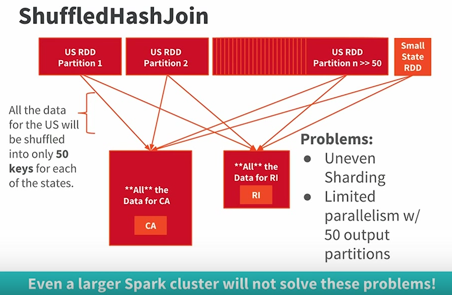
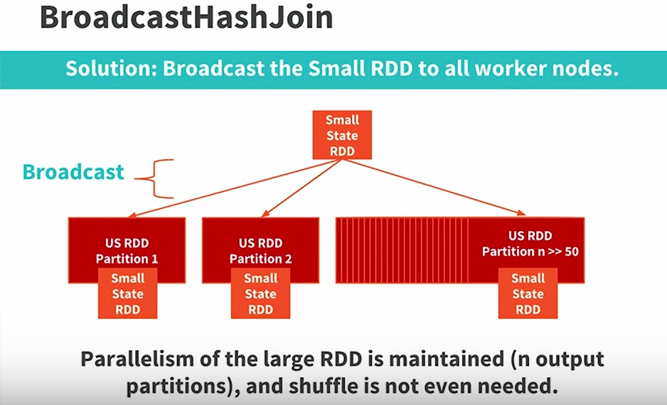
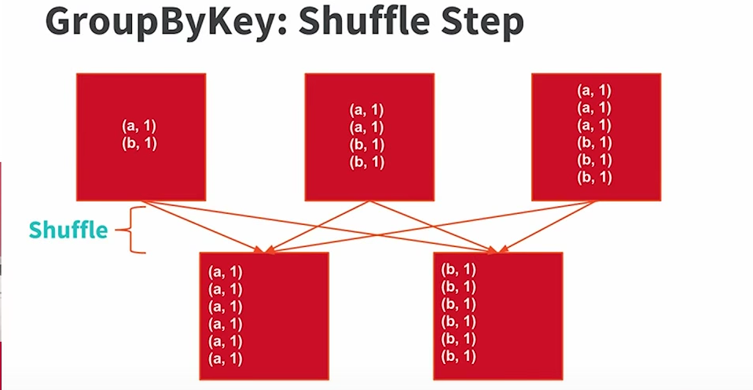
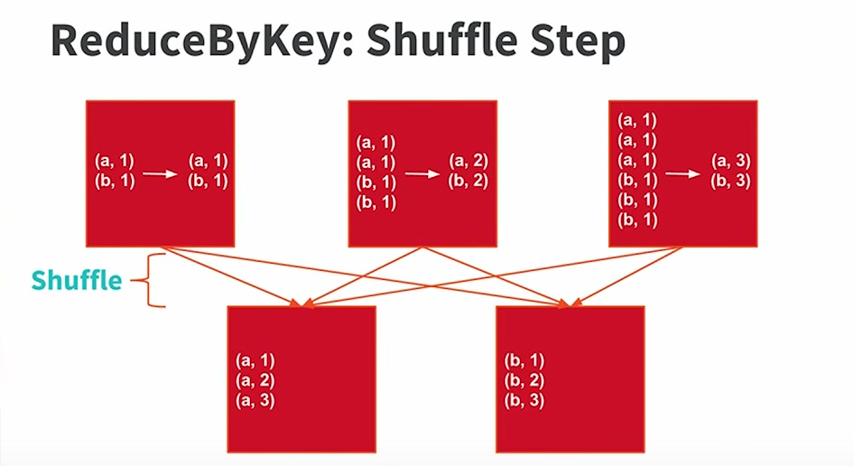

# Apache Spark Test

[](https://www.codacy.com/app/dnvriend/apache-spark-test?utm_source=github.com&amp;utm_medium=referral&amp;utm_content=dnvriend/apache-spark-test&amp;utm_campaign=Badge_Grade)
[](https://travis-ci.org/dnvriend/apache-spark-test)
[](http://www.apache.org/licenses/LICENSE-2.0.txt)

A small study project on how to create and run applications with [Apache Spark 2.0][spark]. Its my personal study project and is mostly a copy/paste of a lot of resources available on the Internet to get the concepts on one page.

We will be using the Structured Query Language (SQL), for a tutorial see the free [SQL tutorial by TutorialsPoint](http://www.tutorialspoint.com/sql/index.htm).

# Introduction
Apache Spark is an Open Source distributed general-purpose cluster computing framework with in-memory data processing engine that can do ETL, analytics, machine learning and graph processing on large volumes of data at rest (batch processing) or in motion (streaming processing) with rich concise high-level APIs for the programming languages: Scala, Python, Java, R, and SQL.

You could also describe Spark as a distributed, data processing engine for batch and streaming modes featuring SQL queries, graph processing, and Machine Learning.

Spark is often called cluster computing engine or simply execution engine.

In contrast to Hadoop’s two-stage disk-based MapReduce processing engine, Spark’s multi-stage in-memory computing engine allows for running most computations in memory, and hence very often provides better performance (there are reports about being up to 100 times faster for certain applications, e.g. iterative algorithms or interactive data mining.

After working with Spark for a short while, I can describe Spark as an interactive batch analytics engine which is optimized for processing a lot of data leveraging RDDs. Because of this, Spark is less suitable for a small amount of data that still needs analytics. For those jobs, a H2 database could be a better fit. Spark also has the same weakness as other data storage systems, it has no strategy implemented to support concurrent, asynchronous updates to the shared data, so the last write to the shared data wins.

# Quick Reference
- [org.apache.spark.sql](https://github.com/apache/spark/tree/master/sql/core/src/main/scala/org/apache/spark/sql)
- [org.apache.spark.sql.functions](https://github.com/apache/spark/blob/master/sql/core/src/main/scala/org/apache/spark/sql/functions.scala)
- [org.apache.spark.sql.Column](https://github.com/apache/spark/blob/master/sql/core/src/main/scala/org/apache/spark/sql/Column.scala)
- [org.apache.spark.sql.Dataset](https://github.com/apache/spark/blob/master/sql/core/src/main/scala/org/apache/spark/sql/Dataset.scala)
- [org.apache.spark.sql.SQLImplicits](https://github.com/apache/spark/blob/master/sql/core/src/main/scala/org/apache/spark/sql/SQLImplicits.scala)
- [Spark Scala Examples](https://github.com/apache/spark/tree/master/examples/src/main/scala/org/apache/spark/examples)

## Glossary
The [Apache Spark documentation contains the glossary](http://spark.apache.org/docs/latest/cluster-overview.html#glossary).

# Downloading Apache Spark
[Downloaded Spark][spark-download], since we won’t be using HDFS, you can download a package for any version of Hadoop.

# Stand-alone Spark cluster
For this project, I am only interested in the stand-alone Spark cluster mode, which consists of a single master node, which is a single point of failure, and multiple worker nodes.

## Launching master
There can only be a single master in [standalone-mode][standalone-mode]. The standalone master can be started by executing:

```bash
$SPARK_HOME/sbin/start-master.sh -h localhost -p 7077
```

Once started, the master will print out a `spark://HOST:PORT` URL for itself, which you can use to connect workers to it, or pass as the _master_ argument to SparkContext. You can also find this URL on the master’s web UI, which is [http://localhost:8080](http://localhost:8080) by default.

Please replace `localhost` by the network ip address if you wish to connect remote workers to this master and configure the remote workers to use the ip address of the master.

## Launching worker
Workers (slaves) connect to the master. Once you have started a worker that has been connected to a master, look at the master’s web UI [http://localhost:8080](http://localhost:8080). You should see the new node listed there, along with its number of _CPUs_ and _memory_.

To start and connect a worker, execute the following:

```bash
$SPARK_HOME/sbin/start-slave.sh spark://localhost:7077 -c 1 -m 1G
```

This will launch a single worker that will connect to your local master at port 7077.

To stop the worker, execute the following command:

```bash
$SPARK_HOME/sbin/stop-slave.sh
```

## Launching multiple workers
To launch multiple workers on a node, you should export the environment variable `SPARK_WORKER_INSTANCES` and then launch the script `start-slave.sh`:

```bash
export SPARK_WORKER_INSTANCES=4
$SPARK_HOME/sbin/start-slave.sh spark://localhost:7077 -c 1 -m 1G
```

## Stopping workers
To stop the workers, execute the following:

```bash
export SPARK_WORKER_INSTANCES=4
$SPARK_HOME/sbin/stop-slave.sh
```

The script will use the `SPARK_WORKER_INSTANCES` if found, and stop all the workers.

# Hands-on with Spark

## Launching the interactive shell
Spark can run interactively through a modified version of the Scala shell (REPL). This is a great way to learn the API. To launch the shell execute the following command, which will connect to the master running on `localhost`:

```bash
$SPARK_HOME/bin/spark-shell --master spark://localhost:7077
```

The [--master](http://spark.apache.org/docs/latest/submitting-applications.html#master-urls) option specifies the master URL for a distributed cluster, or local to run locally with one thread, or local[N] to run locally with N threads. You should start by using local for testing. For a full list of options, run Spark shell with the --help option.

## Spark Context

In the Spark shell you get an initialized [org.apache.spark.SparkContext][sparkcontext] with the value `sc`:

```scala
scala> sc
res1: org.apache.spark.SparkContext = org.apache.spark.SparkContext@5623fd90
```

You also get an instance of the [org.apache.spark.sql.SQLContext][sqlcontext] with the value `spark` to be used with [Spark SQL][sparksql]:

```scala
scala> spark
res2: org.apache.spark.sql.SparkSession = org.apache.spark.sql.SparkSession@6aa27145
```

## Counting
You should now be able to execute the following command, which should return 1000:

```scala
scala> sc.parallelize(1 to 1000).count()
res0: Long = 1000
```

## Distributed Pi Calculation
To calculate Pi, we can create the following application:

```scala
:paste
import scala.math.random
val slices = 50
val n = math.min(10000000L * slices, Int.MaxValue).toInt // avoid overflow
val count = sc.parallelize(1 until n, slices).map { i =>
  val x = random * 2 - 1
  val y = random * 2 - 1
  if (x*x + y*y < 1) 1 else 0
}.reduce(_ + _)
println("Pi is roughly " + 4.0 * count / (n - 1))

<CTRL+D>

Pi is roughly 3.1415012702830025
import scala.math.random
slices: Int = 50
n: Int = 500000000
count: Int = 392687658
```

Note: calculating Pi is faster with less slices like eg: 2.

## Processing a file
To process a file, we first need to get one. Let's download the Spark `readme.md` file and put it into `/tmp`

```bash
wget -O /tmp/readme.md https://raw.githubusercontent.com/apache/spark/master/README.md
```

Spark’s primary abstraction is a distributed collection of items called a [Resilient Distributed Dataset (RDD)][rdd].
RDDs can be created from various sources, like for example the `Range` from the _Counting_ example above. We will create
an RDD from a text file, the `/tmp/readme.md`:

```scala
scala> val textFile = sc.textFile("/tmp/readme.md")
textFile: org.apache.spark.rdd.RDD[String] = /tmp/readme.md MapPartitionsRDD[1] at textFile
```

RDDs have actions, which return values, and transformations, which return pointers to new RDDs. Let’s start with a few actions:

```scala
scala> textFile.count() // Number of items in this RDD
res0: Long = 99

scala> textFile.first() // First item in this RDD
res1: String = # Apache Spark
```

Now let’s use a transformation. We will use the filter transformation to return a new RDD with a subset of the items in the file.

```scala
scala> val linesWithSpark = textFile.filter(line => line.contains("Spark"))
linesWithSpark: org.apache.spark.rdd.RDD[String] = MapPartitionsRDD[2] at filter at <console>:26
```

We can chain together transformations and actions:

```scala
scala> textFile.filter(line => line.contains("Spark")).count() // How many lines contain "Spark"?
res2: Long = 19
```

RDD actions and transformations can be used for more complex computations. Let’s say we want to find the line with the most words:

```scala
scala> textFile.map(line => line.split(" ").size).reduce((a, b) => if (a > b) a else b) // line with most words
res3: Int = 22
```

One common data flow pattern is MapReduce, as popularized by Hadoop. Spark can implement MapReduce flows easily:

```scala
scala> val wordCounts = textFile.flatMap(line => line.split(" ")).map(word => (word, 1)).reduceByKey((a, b) => a + b)
wordCounts: org.apache.spark.rdd.RDD[(String, Int)] = ShuffledRDD[7] at reduceByKey at <console>:26
```

Here, we combined the flatMap, map, and reduceByKey transformations to compute the per-word counts in the file as an RDD
of (String, Int) pairs. To collect the word counts in our shell, we can use the collect action:

```scala
scala> wordCounts.collect()
res4: Array[(String, Int)] = Array((package,1), (this,1), ...)
```

## Persisting / Caching
Spark also supports pulling datasets into a cluster-wide in-memory cache. This is very useful when data is accessed repeatedly,
such as when querying a small 'hot' dataset or when running an iterative algorithm like PageRank. As a simple example, let’s
mark our linesWithSpark dataset to be cached:

```scala
scala> linesWithSpark.cache()
res5: linesWithSpark.type = MapPartitionsRDD[2] at filter at <console>:26

scala> linesWithSpark.count()
res5: Long = 19

scala> linesWithSpark.count()
res6: Long = 19
```

It may seem silly to use Spark to explore and cache a 100-line text file. The interesting part is that these same functions can be used on very large data sets, even when they are striped across tens or hundreds of nodes.

The method `cache` is in fact an alias for the method `persist` which will persist the Dataset with a default storage
level of `MEMORY_AND_DISK`, effectively caching the Dataset in memory.

If you only wish to persist the Dataset in memory, you'll need to use the method `persist` with StorageLevel
`MEMORY_ONLY`. Please see `org.apache.spark.storage.StorageLevel` for more information.

## Unpersisting / Uncaching
To remove all blocks from memory and disk for a Dataset use the method `unpersist()` on the method.

## Spark Web UI
The Web UI (aka webUI or Spark UI after SparkUI) is the web interface of a Spark application to inspect job executions in the SparkContext using a browser.
Every SparkContext launches its own instance of Web UI which is available at http://[ipaddress]:4040 by default (the port can be changed using spark.ui.port setting).

It has the following settings:

- __spark.ui.enabled (default: true)__: controls whether the web UI is started at all
- __spark.ui.port (default: 4040)__: the port Web UI binds to
- __spark.ui.killEnabled (default: true)__:  whether or not you can kill stages in web UI.

# Handy start an stop scripts
You can put the following three scripts in the root of your spark distribution:

## start.sh

```bash
#!/bin/bash
export SPARK_WORKER_INSTANCES=4
sbin/start-master.sh -h localhost -p 7077
sbin/start-slave.sh spark://localhost:7077 -c 1 -m 1G
```

## stop.sh

```bash
#!/bin/bash
export SPARK_WORKER_INSTANCES=4
sbin/stop-slave.sh
sbin/stop-master.sh
```

## shell.sh

```bash
#!/bin/bash
export SPARK_EXECUTOR_INSTANCES=4
bin/spark-shell --master spark://localhost:7077 --verbose
```

# Working with RDDs
Spark revolves around the concept of a [Resilient Distributed Dataset (RDD)][rdd], which is a fault-tolerant collection of elements that can be operated on in parallel. There are two ways to create RDDs: parallelizing an existing collection in your driver program, or referencing a dataset in an external storage system, such as a shared filesystem, HDFS, HBase, or any data source offering a Hadoop InputFormat.

The [Resilient Distributed Dataset (RDD)][rdd] is the primary data abstraction in Apache Spark and the core of Spark (that many often refer to as Spark Core).

A RDD is a resilient and distributed collection of records. One could compare RDD to a Scala collection (that sits on a single JVM) to its distributed variant (that sits on many JVMs, possibly on separate nodes in a cluster).

With RDD the creators of Spark managed to hide data partitioning and so distribution that in turn allowed them to design parallel computational framework with a higher-level programming interface (API).

An RDD is:
- __Resilient__: fault-tolerant with the help of RDD lineage graph (each RDD remembers how it was built from other datasets (by transformations like map, join or groupBy) to rebuild itself) and so able to recompute missing or damaged partitions due to node failures.
- __Distributed__: with data residing on multiple nodes in a cluster.
- __Dataset__: is a collection of partitioned data with primitive values or values of values, e.g. tuples or other objects (that represent records of the data you work with).

Beside the above traits (that are directly embedded in the name of the data abstraction - RDD) it has the following additional traits:

- __In-Memory__: data inside RDD is stored in memory as much (size) and long (time) as possible.
- __Immutable or Read-Only__: it does not change once created and can only be transformed using transformations to new RDDs.
- __Lazy evaluated__: the data inside RDD is not available or transformed until an action is executed that triggers the execution.
- __Cacheable__: you can hold all the data in a persistent "storage" like memory (default and the most preferred) or disk (the least preferred due to access speed).
- __Parallel__: process data in parallel.
- __Typed__: values in a RDD have types, e.g. RDD[Long] or RDD[(Int, String)].
- __Partitioned__: the data inside a RDD is partitioned (split into partitions) and then distributed across nodes in a cluster (one partition per JVM that may or may not correspond to a single node).

An RDD is a named (by name) and uniquely identified (by id) entity inside a SparkContext. It lives in a SparkContext and as a SparkContext creates a logical boundary, RDDs can’t be shared between SparkContexts. An RDD can optionally have a friendly name accessible using name that can be changed.

Lets create an RDD:

```scala
scala> val xs = sc.parallelize(0 to 10)
xs: org.apache.spark.rdd.RDD[Int] = ParallelCollectionRDD[19]

scala> xs.id
res0: Int = 19

scala> xs.name
res1: String = null

scala> xs.name = "my first rdd"
xs.name: String = my first rdd

scala> xs.name
res2: String = my first rdd

scala> xs.toDebugString
res3: String = (4) my first rdd ParallelCollectionRDD[19]

scala> scala> xs.count
res4: Long = 11

scala> xs.take(2).foreach(println)
0
1
```

RDDs are a container of instructions on how to materialize big (arrays of) distributed data, and how to split it into partitions so Spark (using executors) can hold some of them.

In general, data distribution can help executing processing in parallel so a task processes a chunk of data that it could eventually keep in memory.

Spark does jobs in parallel, and RDDs are split into partitions to be processed and written in parallel._Inside a partition, data is processed sequentially!_

Saving partitions results in part-files instead of one single file (unless there is a single partition).

# Types of RDDs
The following are examples of RDDs:

- __org.apache.spark.rdd.JdbcRDD:__ an RDD that executes a SQL query on a JDBC connection and reads results.
- __org.apache.spark.rdd.ParallelCollectionRDD:__ slice a collection into numSlices sub-collections. One extra thing we do here is to treat Range collections specially, encoding the slices as other Ranges to minimize memory cost. This makes it efficient to run Spark over RDDs representing large sets of numbers. And if the collection is an inclusive Range, we use inclusive range for the last slice.
- __org.apache.spark.rdd.CoGroupedRDD:__ an RDD that cogroups its parents. For each key k in parent RDDs, the resulting RDD contains a tuple with the list of values for that key. Should not be instantiated directly but instead use `RDD.cogroup(...)`
- __org.apache.spark.rdd.HadoopRDD:__ an RDD that provides core functionality for reading data stored in HDFS using the older MapReduce API. The most notable use case is the return RDD of SparkContext.textFile.
- __org.apache.spark.rdd.MapPartitionsRDD:__ an RDD that applies the provided function to every partition of the parent RDD; a result of calling operations like map, flatMap, filter, mapPartitions, etc.
- __org.apache.spark.rdd.CoalescedRDD:__ Represents a coalesced RDD that has fewer partitions than its parent RDD; a result of calling operations like repartition and coalesce
- __org.apache.spark.rdd.ShuffledRDD:__ the resulting RDD from a shuffle (e.g. repartitioning of data); a result of shuffling, e.g. after repartition and coalesce
- __org.apache.spark.rdd.PipedRDD:__ an RDD that pipes the contents of each parent partition through an external command (printing them one per line) and returns the output as a collection of strings; an RDD created by piping elements to a forked external process.
- __PairRDD__ (implicit conversion by org.apache.spark.rdd.PairRDDFunctions): that is an RDD of key-value pairs that is a result of groupByKey and join operations.
- __DoubleRDD__ (implicit conversion as org.apache.spark.rdd.DoubleRDDFunctions) that is an RDD of Double type.
- SequenceFileRDD (implicit conversion as org.apache.spark.rdd.SequenceFileRDDFunctions) that is an RDD that can be saved as a SequenceFile.

# Actions
Actions are RDD operations that produce non-RDD values. They materialize a value in a Spark program. In other words, an RDD operation that returns a value of any type.
Actions are synchronous. Note that you can use AsyncRDDActions to release a calling thread while calling actions. Async operations return types that all inherit from `scala.concurrent.Future[T]`.

Actions trigger execution of RDD transformations to return values. Simply put, an action evaluates the RDD lineage graph. Actions materialize the entire processing pipeline with real data.
Actions are one of two ways to send data from _executors_ to the _driver_ (the other being accumulators).

Actions run _jobs_ using `SparkContext.runJob` or directly `DAGScheduler.runJob`.

__Performance tip__: You should _cache_ RDDs you work with when you want to execute two or more actions on it for a better performance.

The following are a subset of actions that is available on `org.apache.spark.rdd.RDD` (there are a lot more):

- __aggregate:__ aggregate the elements of each partition, and then the results for all the partitions, using given combine functions and a neutral "zero value". This function can return a different result type, U, than the type of this RDD, T. Thus, we need one operation for merging a T into an U and one operation for merging two U's, as in scala.TraversableOnce. Both of these functions are allowed to modify and return their first argument instead of creating a new U to avoid memory allocation.
- __collect:__ Return an array that contains all of the elements in this RDD. __Note:__ this method should only be used if the resulting array is expected to be small, as all the data is loaded into the driver's memory.
- __count():__ Return the number of elements in the RDD.
- __countApprox(timeout: Long):__ Approximate version of count() that returns a potentially incomplete result within a timeout, even if not all tasks have finished.
- __countByValue:__ Return the count of each unique value in this RDD as a local map of (value, count) pairs. Note that this method should only be used if the resulting map is expected to be small, as the whole thing is loaded into the driver's memory.
- __first:__ Return the first element in this RDD.
- __fold:__ Aggregate the elements of each partition, and then the results for all the partitions, using a given associative function and a neutral "zero value". The function `op(t1, t2)` is allowed to modify t1 and return it as its result value to avoid object allocation; however, it should not modify t2. This behaves somewhat differently from fold operations implemented for non-distributed collections in functional languages like Scala. This fold operation may be applied to partitions individually, and then fold those results into the final result, rather than apply the fold to each element sequentially in some defined ordering. For functions that are not commutative, the result may differ from that of a fold applied to a non-distributed collection.
- __foreach:__ Applies a function f to all elements of this RDD.
- __foreachPartition:__ Applies a function f to each partition of this RDD.
- __max:__ Returns the max of this RDD as defined by the implicit Ordering[T]
- __min:__ Returns the min of this RDD as defined by the implicit Ordering[T]
- __reduce:__ Reduces the elements of this RDD using the specified commutative and associative binary operator.
- __take:__ Take the first num elements of the RDD. It works by first scanning one partition, and use the results from that partition to estimate the number of additional partitions needed to satisfy the limit.           * @note this method should only be used if the resulting array is expected to be small, as all the data is loaded into the driver's memory.
- __takeOrdered:__ Returns the first k (smallest) elements from this RDD as defined by the specified implicit Ordering[T] and maintains the ordering. This does the opposite of `top`.
- __takeSample:__ Return a fixed-size sampled subset of this RDD in an array. __Note__ this method should only be used if the resulting array is expected to be small, as all the data is loaded into the driver's memory.
- __toLocalIterator:__ Return an iterator that contains all of the elements in this RDD. The iterator will consume as much memory as the largest partition in this RDD. Note: this results in multiple Spark jobs, and if the input RDD is the result of a wide transformation (e.g. join with different partitioners), to avoid recomputing the input RDD should be cached first.
- __top:__ Returns the top k (largest) elements from this RDD as defined by the specified implicit Ordering[T] and maintains the ordering. This does the opposite of `takeOrdered`.
- __treeAggregate:__ Aggregates the elements of this RDD in a multi-level tree pattern.
- __treeReduce:__ Reduces the elements of this RDD in a multi-level tree pattern.
- __saveAsTextFile:__ Save this RDD as a text file, using string representations of elements.
- __saveAsTextFile(CompressionCodec):__ Save this RDD as a compressed text file, using string representations of elements.
- __saveAsObjectFile:__ Save this RDD as a SequenceFile of serialized objects.

# AsyncRDDActions
AsyncRDDActions are RDD operations that produce non-RDD values in an asynchronous manner. These operations releases the calling thread and return a type that inherits from `scala.concurrent.Future[T]`.

The following asynchronous methods are available:
- __countAsync:__
- __collectAsync:__
- __takeAsync:__
- __foreachAsync:__
- __foreachPartitionAsync:__

# Spark SQL
[Spark SQL][sparksql] is a Spark module for structured data processing. Spark SQL knows about the structure of your data because it can infer the structure from the data source it uses, or because the structure has been given by the programmer by means of the Spark SQL API. In any case, because Spark SQL knows about the structure and the operations we wish to perform on the data, Spark SQL can perform extra optimizations. There are several ways to interact with Spark SQL including SQL and the Dataset API. When computing a result the same execution engine is used, independent whether the DataFrame of DataSet API is being used.

Spark SQL provides functions for manipulating large sets of distributed, structured data using a SQL dialect. Spark SQL
can be used for reading and writing data to and from various structured formats and data sources such as JSON, Parquet,
relational databases, CSV, ORC and more.

## Datasets and DataFrames
A Dataset is a distributed collection of data. Dataset is a new interface added in Spark 1.6 that provides the benefits of RDDs (strong typing, ability to use powerful lambda functions) with the benefits of Spark SQL’s optimized execution engine. A Dataset can be constructed from JVM objects and then manipulated using functional transformations (map, flatMap, filter, etc.).

A DataFrame _is a_ Dataset organized into named columns. It is conceptually equivalent to a table in a relational database, but with richer optimizations under the hood. DataFrames can be constructed from a wide array of sources such as:

Please note that there is __no such thing__ as a DataFrame in Spark; a DataFrame is defined as a `Dataset[Row]`.

- structured data files, 
- tables in Hive, 
- external databases, 
- existing RDDs.

In Scala a DataFrame is represented by a Dataset of Rows. A DataFrame is simply a type alias of Dataset[Row].

The main entry point for SparkSQL is the `org.apache.spark.sql.SparkSession` class, which is available in both the SparkShell and Zeppelin notebook as the `spark` value. The `org.apache.spark.SparkContext` is available as the `sc` value, but this is only used for creating RDDs. Read the [SparkSQL Programming Guide][sparksql] on how to create a SparkSession programmatically.

## Creating a DataFrame from an RDD

__Address:__
```scala
import org.apache.spark.sql._
import org.apache.spark.sql.types._

val addressRDD = spark.sparkContext
    .makeRDD(Seq("1,First Street", "2,Second Street"))
    .map(_.split(","))
    .map(xs => Row(xs(0).toInt, xs(1).trim))

val schema = StructType(Array(
    StructField("id", IntegerType, nullable = false),
    StructField("street", StringType, nullable = false)
  ))

val addressDF = spark.createDataFrame(addressRDD, schema)

//
// alternatively, and shorter:
//
final case class Address(id: Int, street: String)
val addressRDD = spark.sparkContext
    .makeRDD(Seq(Address(1,"First Street"), Address(2,"Second Street")))

val address = spark.createDataFrame[Address](addressRDD).as[Address]

//
// and even shorter:
//
final case class Address(id: Int, street: String)
val address = spark.createDataFrame[Address](Seq(Address(1,"First Street"), Address(2,"Second Street"))).as[Address]

//
// or..
//
final case class Address(id: Int, street: String)
val address = spark.createDataset(Seq(Address(1,"First Street"), Address(2,"Second Street")))

//
// and yes, even shorter!
//
import spark.implicits._
final case class Address(id: Int, street: String)
val address = Seq(Address(1,"First Street"), Address(2,"Second Street")).toDS

//
// DataFrame with custom column names
//
import spark.implicits._
final case class Address(id: Int, street: String)
val address = Seq(Address(1,"First Street"), Address(2,"Second Street")).toDF("address_id", "address_name")

//
// Back to an RDD[Address]
//
address.rdd
```

__People:__
```scala
val peopleRDD = spark.sparkContext
    .makeRDD(Seq("1,Mad Max,2", "2,Gilbert Ward Kane,1"))
    .map(_.split(","))
    .map(xs => Row(xs(0).toInt, xs(1).trim, xs(2).toInt))

val peopleSchema = StructType(Array(
    StructField("id", IntegerType, nullable = false),
    StructField("name", StringType, nullable = false),
    StructField("address_fk", IntegerType, nullable = false)
  ))

final case class Person(id: Int, name: String, address_fk: Int)
val people = spark.createDataFrame(peopleRDD, peopleSchema).as[Person]

//
// alternatively, and shorter:
//
final case class Person(id: Int, name: String, address_fk: Int)

val peopleRDD = spark.sparkContext
    .makeRDD(Seq(Person(1,"Mad Max",2), Person(2,"Gilbert Ward Kane",1)))

val people = spark.createDataFrame[Person](peopleRDD).as[Person]

//
// or even shorter still:
//
final case class Person(id: Int, name: String, address_fk: Int)
val people = spark.createDataFrame[Person](Seq(Person(1,"Mad Max",2), Person(2,"Gilbert Ward Kane",1))).as[Person]

//
// or..
//
final case class Person(id: Int, name: String, address_fk: Int)
val people = spark.createDataset(Seq(Person(1,"Mad Max",2), Person(2,"Gilbert Ward Kane",1)))
```

## Creating a Dataset from a DataFrame

```scala
// create a dataset
final case class Address(id: Int, street: String)
val address = addressDF.as[Address]
```

## Creating a temp view

```scala
address.createOrReplaceTempView("address")
people.createOrReplaceTempView("people")
```

## Joining two views

```scala
spark.sql("SELECT p.id, p.name, a.street FROM people p join address a on p.address_fk = a.id order by p.id").show

+---+-----------------+-------------+
| id|             name|       street|
+---+-----------------+-------------+
|  1|          Mad Max|Second Street|
|  2|Gilbert Ward Kane| First Street|
+---+-----------------+-------------+
```

## Save a DataFrame or DataSet
Spark allows you to save your DataFrame or Dataset in a number of formats:

```scala
// save as parquet
address.write.mode("overwrite").parquet("/tmp/address.parquet")
people.write.mode("overwrite").parquet("/tmp/people.parquet")

// orc
address.write.mode("overwrite").orc("/tmp/address.orc")
people.write.mode("overwrite").orc("/tmp/people.orc")

// save as json
address.write.mode("overwrite").json("/tmp/address.json")
people.write.mode("overwrite").json("/tmp/people.json")

// save as csv
address.write.mode("overwrite").csv("/tmp/address.csv")
people.write.mode("overwrite").csv("/tmp/people.csv")

// save as text (only one column can be saved)
address.select('street).write.mode("overwrite").text("/tmp/address.text")
people.select('name).write.mode("overwrite").text("/tmp/people.text")
```

## Saving to persistent tables
Saving to Persistent Tables means materializing the contents of the DataFrame and create a pointer to
the data in the Hive metastore. This means that the data is saved to a Hive table and the table is
registered in the Hive metastore, which means that the table is managed by Hive. Which also
means that you __SHOULD NOT__ remove the tables by hand by eg. `rm -rf` the directories from `spark-warehouse`!

The Hive Metastore is implemented using Derby. By default, spark will create a directory `metastore_db` that
effectively is the model for the Hive database. Spark only has one Hive database named `default`.

Persistent tables exist even after the Spark program has restarted, as long as you maintain your connection to the same metastore.

```scala
address.write.mode("overwrite").saveAsTable("address")
people.write.mode("overwrite").saveAsTable("people")
```

## Saving to an existing table with InsertInto
The `insertInto` method saves data into a table that is managed by Hive, which means that the table
must __already exists__, and has the same schema as the DataFrame you wish to save:

```scala
// create a table and save it in Hive
final case class PersonWithStreet(id: Int, name: String, street: String)
val personWithStreet = spark.createDataset(Seq.empty[PersonWithStreet])
personWithStreet.write.mode("overwrite").saveAsTable("PersonWithStreet")

// create a result that has the same schema as `PersonWithStreet`
val join = spark.sql("SELECT p.id, p.name, a.street FROM people p join address a on p.address_fk = a.id order by p.id")
// insert the join data into the `PersonWithStreet` table
join.write.insertInto("PersonWithStreet")

// show the contents of the `PersonWithStreet` table
spark.table("PersonWithStreet").show
+---+-----------------+-------------+
| id|             name|       street|
+---+-----------------+-------------+
|  2|Gilbert Ward Kane| First Street|
|  1|          Mad Max|Second Street|
+---+-----------------+-------------+
```

## Loading Persistent tables
A DataFrame for a persistent table can be created by calling the table method on a SparkSession `spark` with the name of the table:

```scala
val address = spark.table("address")
val people = spark.table("people")

// or

val address = spark.read.table("address")
val people = spark.read.table("people")
```

## The Catalog
The `org.apache.spark.sql.catalog.Catalog` is an interface through which the user may create, drop, alter or query underlying databases, tables, functions etc.

The Catalog can be accessed by using an in scope `org.apache.spark.sql.SparkSession`, usually the value `spark`. The Catalog is accessible by using the
property `catalog` on an in scope `SparkSession`. The Catalog can:

```scala
// store the catalog in a shorter variable (less typing)
val cat = spark.catalog

// show current database
cat.currentDatabase
res0: String = default

// Returns a list of databases available across all sessions.
cat.listDatabases.show(false)

+-------+---------------------+-------------------------+
|name   |description          |locationUri              |
+-------+---------------------+-------------------------+
|default|Default Hive database|file:/tmp/spark-warehouse|
+-------+---------------------+-------------------------+

// return a list of tables in the current database
cat.listTables.show

// or

// return a list of tables in the specified database
cat.listTables("default").show

+--------+--------+-----------+---------+-----------+
|    name|database|description|tableType|isTemporary|
+--------+--------+-----------+---------+-----------+
|   posts| default|       null|  MANAGED|      false|
|aangifte|    null|       null|TEMPORARY|       true|
+--------+--------+-----------+---------+-----------+

// drop a temporary view
cat.dropTempView("aangifte")

+-----+--------+-----------+---------+-----------+
| name|database|description|tableType|isTemporary|
+-----+--------+-----------+---------+-----------+
|posts| default|       null|  MANAGED|      false|
+-----+--------+-----------+---------+-----------+

// list the columns
cat.listColumns("posts").show

+----------------+-----------+--------+--------+-----------+--------+
|            name|description|dataType|nullable|isPartition|isBucket|
+----------------+-----------+--------+--------+-----------+--------+
|acceptedanswerid|       null|  bigint|    true|      false|   false|
|     answercount|       null|  bigint|    true|      false|   false|
|            body|       null|  string|    true|      false|   false|
|    commentcount|       null|  bigint|    true|      false|   false|
|    creationdate|       null|  string|    true|      false|   false|
|              id|       null|  bigint|    true|      false|   false|
|lastactivitydate|       null|  string|    true|      false|   false|
|     owneruserid|       null|  bigint|    true|      false|   false|
|      posttypeid|       null|  bigint|    true|      false|   false|
|           score|       null|  bigint|    true|      false|   false|
|            tags|       null|  string|    true|      false|   false|
|           title|       null|  string|    true|      false|   false|
|       viewcount|       null|  bigint|    true|      false|   false|
+----------------+-----------+--------+--------+-----------+--------+

// set the current default database in this session
cat.setCurrentDatabase("default")

// dropping a table
spark.sql("DROP TABLE IF EXISTS posts")

// get a list of all the tables
cat.listTables.show

+----+--------+-----------+---------+-----------+
|name|database|description|tableType|isTemporary|
+----+--------+-----------+---------+-----------+
+----+--------+-----------+---------+-----------+
```

# Operating on multiple Datasets
We have the following dataset:

```scala
final case class Zip(value: String)
val zips1 = spark.createDataset(Seq(
    Zip("1000AA-001"),
    Zip("1000AA-002"),
    Zip("1000AA-003"),
    Zip("1000AA-004")))

val zips2 = spark.createDataset(Seq(Zip("1000AA-001")))

zips1.createOrReplaceTempView("zips1")
zips2.createOrReplaceTempView("zips2")
```

## UNION: Append rows of one dataset to the other dataset
Returns a new Dataset containing union of rows in this Dataset and another Dataset.

```scala
zips1.union(zips2).show

//or

spark.sql("FROM zips1 UNION ALL FROM zips2").show

+----------+
|     value|
+----------+
|1000AA-001|
|1000AA-002|
|1000AA-003|
|1000AA-004|
|1000AA-001|
+----------+
```

## INTERSECT: Only matching rows
Returns a new Dataset containing rows only in both this Dataset and another Dataset.

```scala
zips1.intersect(zips2).show

// or

spark.sql("FROM zips1 INTERSECT FROM zips2").show

+----------+
|     value|
+----------+
|1000AA-001|
+----------+
```

## EXCEPT: Rows in this dataset but NOT in other dataset
Returns a new Dataset containing rows in this Dataset but not in another Dataset.

```scala
zips1.except(zips2).show

// or

spark.sql("FROM zips1 EXCEPT FROM zips2").show

+----------+
|     value|
+----------+
|1000AA-002|
|1000AA-004|
|1000AA-003|
+----------+
```

## ROLLUP and CUBE: subtotals and grand totals used with GROUP BY
Example taken from [Database Journal -  Using the ROLLUP, CUBE, and GROUPING SETS Operators](http://www.databasejournal.com/features/mssql/using-the-rollup-cube-and-grouping-sets-operators.html).

The `ROLLUP` and `CUBE` operations on Dataset are used with the `GROUP BY` clause and allow you to create __subtotals__,
__grand totals__ and ___superset of subtotals__.

What do the `ROLLUP` and `CUBE` do?  They allow you to create subtotals and grand totals a number of different ways.

The ROLLUP operator is used with the GROUP BY clause. It is used to create _subtotals_ and _grand totals_ for a set of columns.
The summarized amounts are created based on the columns passed to the ROLLUP operator.

The CUBE operators, like the ROLLUP operator produces _subtotals_ and _grand totals_ as well.  But unlike the ROLLUP operator
it produces subtotals and grand totals _for every permutation of the columns_ provided to the CUBE operator.

Lets look at an example:

```scala
final case class PurchaseItem(
      PurchaseID: Int,
      Supplier: String,
      PurchaseType: String,
      PurchaseAmt: Double,
      PurchaseDate: java.sql.Date
    )

// implicit convert the String formatted date to java.sql.Date
// as I just copied the data from the website
implicit def strToSqlDate(str: String): java.sql.Date =
 new java.sql.Date(new java.text.SimpleDateFormat("yyyy-MM-dd").parse(str).getTime)

// create the Dataset
val items = spark.createDataset(Seq(
    PurchaseItem (1, "McLendon's","Hardware",2121.09,"2014-01-12"),
     PurchaseItem (2, "Bond","Electrical",12347.87,"2014-01-18"),
     PurchaseItem (3, "Craftsman","Hardware",999.99,"2014-01-22"),
     PurchaseItem (4, "Stanley","Hardware",6532.09,"2014-01-31"),
     PurchaseItem (5, "RubberMaid","Kitchenware",3421.10,"2014-02-03"),
     PurchaseItem (6, "RubberMaid","KitchenWare",1290.90,"2014-02-07"),
     PurchaseItem (7, "Glidden","Paint",12987.01,"2014-02-10"),
     PurchaseItem (8, "Dunn's","Lumber",43235.67,"2014-02-21"),
     PurchaseItem (9, "Maytag","Appliances",89320.19,"2014-03-10"),
     PurchaseItem (10, "Amana","Appliances",53821.19,"2014-03-12"),
     PurchaseItem (11, "Lumber Surplus","Lumber",3245.59,"2014-03-14"),
     PurchaseItem (12, "Global Source","Outdoor",3331.59,"2014-03-19"),
     PurchaseItem (13, "Scott's","Garden",2321.01,"2014-03-21"),
     PurchaseItem (14, "Platt","Electrical",3456.01,"2014-04-03"),
     PurchaseItem (15, "Platt","Electrical",1253.87,"2014-04-21"),
     PurchaseItem (16, "RubberMaid","Kitchenware",3332.89,"2014-04-20"),
     PurchaseItem (17, "Cresent","Lighting",345.11,"2014-04-22"),
     PurchaseItem (18, "Snap-on","Hardware",2347.09,"2014-05-03"),
     PurchaseItem (19, "Dunn's","Lumber",1243.78,"2014-05-08"),
     PurchaseItem (20, "Maytag","Appliances",89876.90,"2014-05-10"),
     PurchaseItem (21, "Parker","Paint",1231.22,"2014-05-10"),
     PurchaseItem (22, "Scotts's","Garden",3246.98,"2014-05-12"),
     PurchaseItem (23, "Jasper","Outdoor",2325.98,"2014-05-14"),
     PurchaseItem (24, "Global Source","Outdoor",8786.99,"2014-05-21"),
     PurchaseItem (25, "Craftsman","Hardware",12341.09,"2014-05-22")
    ))

// create a temp view
items.createOrReplaceTempView("items")
```

The ROLLUP operator allows Spark to create _subtotals_ and _grand totals_, while it groups data using the GROUP BY clause.
Lets use the ROLLUP operator to generator a grand total by PurchaseType:

Lets first look at the GROUP BY __without__ the ROLLUP:

```scala
spark.sql(
"""
SELECT coalesce (PurchaseType,'GrandTotal') AS PurchaseType
     , sum(PurchaseAmt) as SummorizedPurchaseAmt
FROM items
GROUP BY PurchaseType
ORDER BY SummorizedPurchaseAmt
"""
).show(25)

// note: the `COALESCE` function returns the first non-null expr in the expression list, so in this case
// if PurchaseType is `null` then the function will return 'GrandTotal' else it will return the value
// of PurchaseType

+------------+---------------------+
|PurchaseType|SummorizedPurchaseAmt|
+------------+---------------------+
|    Lighting|               345.11|
| KitchenWare|               1290.9|
|      Garden|              5567.99|
| Kitchenware|              6753.99|
|       Paint|             14218.23|
|     Outdoor|             14444.56|
|  Electrical|             17057.75|
|    Hardware|             24341.35|
|      Lumber|    47725.03999999999|
|  Appliances|            233018.28|
+------------+---------------------+
```

It looks like a normal GROUP BY with a SUM of the amount, nothing special here. Note, because we are not using
ROLLUP yet, the `GrandTotal` result will not be shown, also the `COALESCE` function does not have a lot of work
as `PurchaseType` will never be _null_.  Without the coalesce function the PurchaceType column value would have
been 'null' for the grand total row.

Now the GROUP BY with the ROLLUP:

```scala
spark.sql(
"""
SELECT coalesce (PurchaseType,'GrandTotal') AS PurchaseType
     , sum(PurchaseAmt) as SummorizedPurchaseAmt
FROM items
GROUP BY ROLLUP(PurchaseType)
ORDER BY SummorizedPurchaseAmt
"""
).show(25)

+------------+---------------------+
|PurchaseType|SummorizedPurchaseAmt|
+------------+---------------------+
|    Lighting|               345.11|
| KitchenWare|               1290.9|
|      Garden|              5567.99|
| Kitchenware|              6753.99|
|       Paint|             14218.23|
|     Outdoor|             14444.56|
|  Electrical|             17057.75|
|    Hardware|             24341.35|
|      Lumber|    47725.03999999999|
|  Appliances|            233018.28|
|  GrandTotal|             364763.2|
+------------+---------------------+
```

The `GROUP BY ROLLUP` added a new record `GrandTotal` which is the sum of all the subtotals.

__Subtotals by Month and a GrandTotal:__

Suppose we want to calculate the subtotals of ProductTypes by month,
with a monthly total amount for all the products sold in the month, we could express
it as follows:

```scala
spark.sql(
"""
SELECT coalesce(month(PurchaseDate), 99) PurchaseMonth
     , CASE WHEN month(PurchaseDate) is null then 'Grand Total'
            ELSE coalesce (PurchaseType,'Monthly Total') end AS PurchaseType
     , round(Sum(PurchaseAmt), 2) as SummorizedPurchaseAmt
FROM items
GROUP BY ROLLUP(month(PurchaseDate), PurchaseType)
ORDER BY PurchaseMonth, SummorizedPurchaseAmt
"""
).show(100)

+-------------+-------------+---------------------+
|PurchaseMonth| PurchaseType|SummorizedPurchaseAmt|
+-------------+-------------+---------------------+
|            1|     Hardware|              9653.17|
|            1|   Electrical|             12347.87|
|            1|Monthly Total|             22001.04|
|            2|  KitchenWare|               1290.9|
|            2|  Kitchenware|               3421.1|
|            2|        Paint|             12987.01|
|            2|       Lumber|             43235.67|
|            2|Monthly Total|             60934.68|
|            3|       Garden|              2321.01|
|            3|       Lumber|              3245.59|
|            3|      Outdoor|              3331.59|
|            3|   Appliances|            143141.38|
|            3|Monthly Total|            152039.57|
|            4|     Lighting|               345.11|
|            4|  Kitchenware|              3332.89|
|            4|   Electrical|              4709.88|
|            4|Monthly Total|              8387.88|
|            5|        Paint|              1231.22|
|            5|       Lumber|              1243.78|
|            5|       Garden|              3246.98|
|            5|      Outdoor|             11112.97|
|            5|     Hardware|             14688.18|
|            5|   Appliances|              89876.9|
|            5|Monthly Total|            121400.03|
|           99|  Grand Total|             364763.2|
+-------------+-------------+---------------------+
```

Here we have included two columns in the ROLLUP clause. The first column was the month of the purchase,
and the second column is PurchaseType. This allowed us to create the subtotals by ProductType by month,
as well as Monthly Total amount at the end of every month. Additionally this code creates a Grant Total amount of all
product sales at the end.

__CUBE:__
Suppose we want to calculate the subtotals for each PurchaseType per month, followed by the GrandTotal for each PurchaseType,
followed by the GrandTotal per month for all purchases, followed by a Grand Total overall, we can express that as follows:

```scala
spark.sql(
"""
SELECT month(PurchaseDate) PurchaseMonth
     , CASE WHEN month(PurchaseDate) is null
        THEN coalesce (concat('Grand Total for ', PurchaseType),'Grand Total')
        ELSE coalesce (PurchaseType,'Monthly SubTotal') end AS PurchaseType
     , round(Sum(PurchaseAmt), 2) as SummorizedPurchaseAmt
FROM items
GROUP BY CUBE(month(PurchaseDate), PurchaseType)
ORDER BY PurchaseType, PurchaseMonth
"""
).show(100, false)

+-------------+---------------------------+---------------------+
|PurchaseMonth|PurchaseType               |SummorizedPurchaseAmt|
+-------------+---------------------------+---------------------+
|3            |Appliances                 |143141.38            |
|5            |Appliances                 |89876.9              |
|1            |Electrical                 |12347.87             |
|4            |Electrical                 |4709.88              |
|3            |Garden                     |2321.01              |
|5            |Garden                     |3246.98              |
|null         |Grand Total                |364763.2             |
|null         |Grand Total for Appliances |233018.28            |
|null         |Grand Total for Electrical |17057.75             |
|null         |Grand Total for Garden     |5567.99              |
|null         |Grand Total for Hardware   |24341.35             |
|null         |Grand Total for KitchenWare|1290.9               |
|null         |Grand Total for Kitchenware|6753.99              |
|null         |Grand Total for Lighting   |345.11               |
|null         |Grand Total for Lumber     |47725.04             |
|null         |Grand Total for Outdoor    |14444.56             |
|null         |Grand Total for Paint      |14218.23             |
|1            |Hardware                   |9653.17              |
|5            |Hardware                   |14688.18             |
|2            |KitchenWare                |1290.9               |
|2            |Kitchenware                |3421.1               |
|4            |Kitchenware                |3332.89              |
|4            |Lighting                   |345.11               |
|2            |Lumber                     |43235.67             |
|3            |Lumber                     |3245.59              |
|5            |Lumber                     |1243.78              |
|1            |Monthly SubTotal           |22001.04             |
|2            |Monthly SubTotal           |60934.68             |
|3            |Monthly SubTotal           |152039.57            |
|4            |Monthly SubTotal           |8387.88              |
|5            |Monthly SubTotal           |121400.03            |
|3            |Outdoor                    |3331.59              |
|5            |Outdoor                    |11112.97             |
|2            |Paint                      |12987.01             |
|5            |Paint                      |1231.22              |
+-------------+---------------------------+---------------------+
```

# Functions available on Dataset
Spark SQL provides a [lot of functions](http://spark.apache.org/docs/latest/api/scala/index.html#org.apache.spark.sql.functions$)
that can be used on Datasets and are available in SQL queries:

```scala
// Calculates the SHA-1 digest of a binary column and returns the value as a 40 character hex string.
spark.sql("SELECT sha1('Hello World!') sha1").show(false)

+----------------------------------------+
|sha1                                    |
+----------------------------------------+
|2ef7bde608ce5404e97d5f042f95f89f1c232871|
+----------------------------------------+

// Formats numeric column x to a format like '#,###,###.##',
// rounded to d decimal places, and returns the result as a string column.
spark.sql("SELECT format_number(1025, 2) formatted").show(false)

+---------+
|formatted|
+---------+
|1,025.00 |
+---------+

// reverse
spark.sql("SELECT reverse('boat') result").show(false)

+------+
|result|
+------+
|taob  |
+------+

// concat strings
spark.sql("SELECT concat('Hello', ' ', 'World!') result").show(false)

+------------+
|result      |
+------------+
|Hello World!|
+------------+

// Returns the current timestamp as a timestamp column.
spark.sql("SELECT current_timestamp() result").show(false)

+-----------------------+
|result                 |
+-----------------------+
|2016-08-03 22:12:54.546|
+-----------------------+
```

And [many more functions](http://spark.apache.org/docs/latest/api/scala/index.html#org.apache.spark.sql.functions$).

## User Defined Functions (UDFs)
User-Defined Functions (UDFs) is a feature of Spark SQL to define new Column-based functions that extend the already
rich vocabulary of Spark SQL’s DSL that contains more than 50 functions to transform Datasets.

UDFs are very handy because functions can be materialized anywhere in the cluster, so the function can be at the
same physical location as the data, this makes operating on data using UDFs very efficient.

You define a new UDF by defining a Scala function as an input parameter of udf function:

```scala
// lets create a DataFrame
val df = Seq((0, "hello"), (1, "world")).toDF("id", "text")
df.show

+---+-----+
| id| text|
+---+-----+
|  0|hello|
|  1|world|
+---+-----+

// define a plain old Scala Function
val upper: String => String = _.toUpperCase + "- foo"

// create a User Defined Function
import org.apache.spark.sql.functions.udf
val upperUDF = udf(upper)

// apply the user defined function
df.withColumn("upper", upperUDF('text)).show

+---+-----+----------+
| id| text|     upper|
+---+-----+----------+
|  0|hello|HELLO- foo|
|  1|world|WORLD- foo|
+---+-----+----------+

// the UDF can be used in a query
// first register a temp view so that
// we can reference the DataFrame
df.createOrReplaceTempView("df")

// register the UDF by name 'upperUDF'
spark.udf.register("upperUDF", upper)

// use the UDF in a SQL-Query
spark.sql("SELECT *, upperUDF(text) FROM df").show

+---+-----+----------+
| id| text| UDF(text)|
+---+-----+----------+
|  0|hello|HELLO- foo|
|  1|world|WORLD- foo|
+---+-----+----------+
```

## Generating Unique IDs
Spark can create unique ids using the ` monotonically_increasing_id` function, which is part of `org.apache.spark.sql.function` and UUIDs when we create a User Defined Function (UDF) for it:

```scala
// create a simple Dataset
val test = Seq("x1", "x1", "x2", "x3", "x4").toDF("x")
test.createOrReplaceTempView("test")
test.show

+---+
|  x|
+---+
| x1|
| x1|
| x2|
| x3|
| x4|
+---+

// register a UDF for our UUID function
import java.util.UUID
spark.udf.register("uuid", () => UUID.randomUUID.toString)

// lets create a result that has a monotonically increasing ID column, and a UUID column:
spark.sql("SELECT *, monotonically_increasing_id() id, uuid() uuid from test").show(false)

+---+---+------------------------------------+
|x  |id |uuid                                |
+---+---+------------------------------------+
|x1 |0  |717ca817-b364-419a-8151-1ef0907203b5|
|x1 |1  |61d18c20-15dc-4953-aee0-b99195a3903f|
|x2 |2  |bfa0689b-0b2d-4d8a-bf10-efdd09a99636|
|x3 |3  |9eb6a136-ee26-4188-9c99-ba3cc3324c94|
|x4 |4  |b1a52edb-80fb-4b93-b1e1-ffa682ac57f7|
+---+---+------------------------------------+
```

## Array functions
Spark supports an ArrayType, so a column can be of type Array. This can be handy when we use the table as a document, in which all the data is stored in the table and the data is not normalized leveraging relational algebra into two or more tables.

We won't be touching the performance characteristics of the ArrayType vs. normalizing and using a JOIN column, but instead look at how we can use it using a simple example of a Book having multiple authors, in which the author_ids is an Array type that holds the authors's ids.

The array functions we will use are all a member of `org.apache.spark.sql.functions`:

```scala
final case class Book(id: Int, author_ids: List[Int])
val orders = Seq(Book(1, List(1)), Book(2, List(1, 2)), Book(3, List(1, 2, 3))).toDS
orders.createOrReplaceTempView("books")

// select the books that author 1 has worked on
spark.sql("select * from books WHERE array_contains(author_ids, 1)").show

+---+----------+
| id|author_ids|
+---+----------+
|  1|       [1]|
|  2|    [1, 2]|
|  3| [1, 2, 3]|
+---+----------+

// returns the size of the array
spark.sql("select *, size(author_ids) size from books").show

+---+----------+----+
| id|author_ids|size|
+---+----------+----+
|  1|       [1]|   1|
|  2|    [1, 2]|   2|
|  3| [1, 2, 3]|   3|
+---+----------+----+

// sort the array:
spark.sql("select *, sort_array(author_ids, false) sorted  from books").show

+---+----------+---------+
| id|author_ids|   sorted|
+---+----------+---------+
|  1|       [1]|      [1]|
|  2|    [1, 2]|   [2, 1]|
|  3| [1, 2, 3]|[3, 2, 1]|
+---+----------+---------+

// create a new row for each element in the array
spark.sql("select *, explode(author_ids) exploded  from books").show

+---+----------+--------+
| id|author_ids|exploded|
+---+----------+--------+
|  1|       [1]|       1|
|  2|    [1, 2]|       1|
|  2|    [1, 2]|       2|
|  3| [1, 2, 3]|       1|
|  3| [1, 2, 3]|       2|
|  3| [1, 2, 3]|       3|
+---+----------+--------+

// create a new row for each element in the array with position information
spark.sql("select *, posexplode(author_ids) from books").show

+---+----------+---+---+
| id|author_ids|pos|col|
+---+----------+---+---+
|  1|       [1]|  0|  1|
|  2|    [1, 2]|  0|  1|
|  2|    [1, 2]|  1|  2|
|  3| [1, 2, 3]|  0|  1|
|  3| [1, 2, 3]|  1|  2|
|  3| [1, 2, 3]|  2|  3|
+---+----------+---+---+

// create an array column from the value of a column and a function
spark.sql("select *, array(id, monotonically_increasing_id()) ids from books").show

+---+----------+------+
| id|author_ids|   ids|
+---+----------+------+
|  1|       [1]|[1, 0]|
|  2|    [1, 2]|[2, 1]|
|  3| [1, 2, 3]|[3, 2]|
+---+----------+------+
```

## 'Deleting' rows
Spark SQL allows SQL expressions to operate on RDDs under the hood. Remember that RDDs are immutable and the workflow that Spark gives developers are transformations on RDDs so we transform one RDD into another and so on. Working with SQL however can give the illusion that we are working with a mutable data structure like we are used to with Databases, which is not the case.

So there is no such thing as deleting a row in an RDD, so Spark SQL doesn't support the DELETE or TRUNCATE operation. What we _can_ do is create a new RDD in which the row isn't present by transforming the RDD into a new RDD where we have FILTERED the row that we don't want to have present:

```scala
val test = Seq("x1", "x1", "x2", "x3", "x4").toDF("x")
test.createOrReplaceTempView("test")
test.show

+---+
|  x|
+---+
| x1|
| x1|
| x2|
| x3|
| x4|
+---+

// filter 'x1', we don't want them present in the new RDD:
sql("FROM test WHERE x != 'x1'").show

+---+
|  x|
+---+
| x2|
| x3|
| x4|
+---+
```

## Pivot tables
A pivot is an aggregation where one or more of the grouping columns has its distinct values transposed into individual columns.

TBD

## SQL
Spark 2.0 can run all the [99 TPC-DS queries](http://www.tpc.org/tpcds/default.asp), which require many of the [SQL:2003](https://en.wikipedia.org/wiki/SQL:2003) features and has support for subqueries. Because SQL has been one of the primary interfaces Spark applications use, this extended SQL capabilities drastically reduce the porting effort of legacy applications over to Spark.

Interactive analytics using [Structured Query Language (SQL)](https://en.wikipedia.org/wiki/SQL) has always been a preferred language for analysts because of its power to interact with the Dataset, but with the emergence of Big Data it was difficult to continue using SQL over RDBMS for interactive analytics. Spark provides a __highly optimized SQL engine__ on top of the Spark core framework and makes use of the power of RDDs (the power of the DAG; like eg: node crashes, RDDs + DAG can rebuild only that single RDD for the crashed node) to provide real time analytics on Big Data leveraging the DataFrame / Dataset API, Catalyst query optimizer all being supported by [Project Tungsten](https://databricks.com/blog/2015/04/28/project-tungsten-bringing-spark-closer-to-bare-metal.html).

Spark supports the [Hive SQL syntax]()https://cwiki.apache.org/confluence/display/Hive/LanguageManual+Select, except [some functionality](https://spark.apache.org/docs/latest/sql-programming-guide.html#unsupported-hive-functionality).

Spark [supports the following SQL](http://docs.datastax.com/en/datastax_enterprise/5.0/datastax_enterprise/spark/sparkSqlSupportedSyntax.html):

The following syntax defines a SELECT query.

```sql
SELECT [DISTINCT] [column names]|[wildcard]
FROM [keyspace name.]table name
[JOIN clause table name ON join condition]
[WHERE condition]
[GROUP BY column name]
[HAVING conditions]
[ORDER BY column names [ASC | DSC]]
```

A SELECT query using joins has the following syntax.

```sql
SELECT statement
FROM statement
[JOIN | INNER JOIN | LEFT JOIN | LEFT SEMI JOIN | LEFT OUTER JOIN | RIGHT JOIN | RIGHT OUTER JOIN | FULL JOIN | FULL OUTER JOIN]
ON join condition
```

Several select clauses can be combined in a `UNION`, `INTERSECT`, or `EXCEPT` query.

```sql
SELECT statement 1
[UNION | UNION ALL | UNION DISTINCT | INTERSECT | EXCEPT]
SELECT statement 2
```

Note: Select queries run on new columns return '', or empty results, instead of None.

The following syntax defines an INSERT query.

```sql
INSERT [OVERWRITE] INTO [keyspace name.]table name [(columns)]
VALUES values
```

The following syntax defines a CACHE TABLE query.

```sql
CACHE TABLE table name [AS table alias]
```

You can remove a table from the cache using a UNCACHE TABLE query.

```sql
UNCACHE TABLE table name
```

The following keywords are reserved in Spark SQL:

```sql
ALL
AND
AS
ASC
APPROXIMATE
AVG
BETWEEN
BY
CACHE
CAST
COUNT
DESC
DISTINCT
FALSE
FIRST
LAST
FROM
FULL
GROUP
HAVING
IF
IN
INNER
INSERT
INTO
IS
JOIN
LEFT
LIMIT
MAX
MIN
NOT
NULL
ON
OR
OVERWRITE
LIKE
RLIKE
UPPER
LOWER
REGEXP
ORDER
OUTER
RIGHT
SELECT
SEMI
STRING
SUM
TABLE
TIMESTAMP
TRUE
UNCACHE
UNION
WHERE
INTERSECT
EXCEPT
SUBSTR
SUBSTRING
SQRT
ABS
```

## The Shuffle
__TL;DR:__
First do a __combine-before-shuffle__ step, then the shuffle (transfer), as the shuffle _cannot_ be prevented.

Shuffle occurs to transfer all data with the same key to the same worker node.

For example, imagine that `mydata.csv` is read by a number of worker node that each read (a part) of the csv file and will hold that part of the data in memory, `mydata.csv` has been partitioned:

```scala
val pairs = sc.textFile("/tmp/mydata.csv")
  .flatMap(_.split(","))
  .map(word => (word, 1))
```

When we call `reduceByKey` or `groupByKey`, what we are asking Spark to do is take all the key/value-pairs that have the same key and put all them on the same machine (partition), so that is going to trigger a `shuffle` that will transfer all the data with the same key to the same machine (partition). Remember, `mydata.csv` data has been distributed over multiple worker nodes, each having read a chunk of the CSV and each having a part of the key/value pairs, but when we want a new RDD having all the pairs eg. _grouped-by-key_, Spark must copy all the pairs with the same matching keys to the same worker node (partition), this can only be done with a `shuffle`.

```scala
pairs.reduceByKey

// or

pairs.groupByKey
```

## Why so many Spark jobs?
StackOverflow: [Why so many tasks in my spark jobs?](http://stackoverflow.com/questions/37758647/why-so-many-tasks-in-my-spark-job).

__Answer:__
This is a classic Spark question.

The two tasks used for reading (Stage Id 0 in second figure) is the defaultMinPartitions setting which is set to 2. You can get this parameter by reading the value in the REPL `sc.defaultMinPartitions`. It should also be visible in the Spark UI under the "Environment" tap.

You can take a look at the [code from github](https://github.com/apache/spark/blob/master/core/src/main/scala/org/apache/spark/SparkContext.scala#L799) to see that this exactly what is happening. If you want more partitions to be used on read, just add it as a parameter e.g., `sc.textFile("a.txt", 20)`.

Now the interesting part comes from the `200 partitions` that come on the second stage (Stage Id 1 in second figure). Well, each time there is a shuffle, Spark needs to decide how many partitions will the shuffle RDD have. As you can imagine, the default is 200.

You can change that using `spark.sql.shuffle.partitions` set to  eg. `4`.

If you run your code with this configuration you will see that the 200 partitions are not going to be there any more. How to set this parameter is kind of an art. Maybe choose _2x the number of cores_ you have (or whatever).

I think Spark 2.0 has a way to automatically infer the best number of partitions for shuffle RDDs. Looking forward to that!

Finally, the number of jobs you get has to do with how many __RDD actions__ the resulting optimized Dataframe code resulted to. If you read the Spark specs it says that _each RDD action will trigger one job_. When your action involves a Dataframe or SparkSQL the Catalyst optimizer will figure out an execution plan and generate some RDD based code to execute it. It's hard to say exactly why it uses two actions in your case. You may need to look at the optimized query plan to see exactly what is doing.

## How to optimize?
Nobody can tell you. __You should understand your data and it's unique properties in order to best optimize your Spark job.__

## ShuffledHashJoin


## BroadcastHashJoin


To show all the config, execute `SET -v` in Spark SQL:

```
spark.sql.autoBroadcastJoinThreshold=10,485,760
```

## Analyze Tables
[SPARK-4760](https://issues.apache.org/jira/browse/SPARK-4760): The native parquet support (which is used for both Spark SQL and Hive DDL by default) automatically computes sizes starting with Spark 1.3. So running ANALYZE is not needed for auto broadcast joins anymore. Please reopen if you see any issues with this new feature.

[Do we support analyze table table_name compute statistics for Spark SQl?](https://forums.databricks.com/questions/2645/do-we-support-analyze-table-table-name-compute-sta.html): If you created the table using one of the new Dataframes API implementations, then this functionality is not supported.

## GroupByKey (shuffle-first)
With group-by-key all the data is sent over the network and collected on the partition. Moreover, more data has to be stored as there has not been a reduce phase; it will use more disk space as a result because the new partitions have to store all the data.



This does not mean that groupByKey has to be avoided at all cost like the [best practise from databricks](https://databricks.gitbooks.io/databricks-spark-knowledge-base/content/best_practices/prefer_reducebykey_over_groupbykey.html), it has to be used where it is appropriate as `reduceByKey` cannot solve all problems.

## ReduceByKey (combine-before-shuffle)
ReduceByKey works much better on a large dataset. That's because Spark knows it can __combine__ output with a common key on each partition before shuffling the data, which leads to less data to be transferred.

For example:



With ReduceByKey, data is combined so each partition outputs at most one value for each key to send over the network. Moreover, we have to __store less__ data on the new partitions as the key/value pairs are combined, which leads to more performance when we want to operate on them.

## AggregateByKey (combine-before-shuffle)
Aggregate the values of each key, using given combine functions and a neutral "zero value". Returns `RDD[(K, U)]` which is lazy.

## FoldByKey (combine-before-shuffle)
Merges the values for each key using an associative function and a neutral "zero value". Returns a `RDD[(K, V)]` which is lazy.

## CombineByKey (combine-before-transfer)
[org.apache.spark.rdd.PairRDDFunctions](https://github.com/apache/spark/blob/master/core/src/main/scala/org/apache/spark/rdd/PairRDDFunctions.scala#L113)

Combination step before shuffle. Can be used when you are combining elements but your return type differs from your input value type. Returns `RDD[(K, C)]` which is lazy.

## CountByKey (Map[K, Long])
Group the values for each key in the RDD into a single sequence. Allows controlling the partitioning of the resulting key-value pair RDD by passing a Partitioner. Note, because the whole result is moved to the driver application, it can cause an Out Of Memory (OOM) error.

## collectAsMap (Map[K, V])
Return the key-value pairs in this RDD to the master as a Map. Returns `Map[K, V]` so beware of __OOM__.

## countByValue (Map[T, Long])
Return the count of each unique value in this RDD as a local map of (value, count) pairs. Returns `Map[K, V]` so beware of __OOM__.

## Collect (Array[T])
Return an array that contains all of the elements in this RDD. Returns an `Array[T]`, so beware of __OOM__.

## CLUSTER BY
CLUSTER BY is a short-cut for both DISTRIBUTE BY and SORT BY.

## DISTRIBUTE BY
DISTRIBUTE BY distributes the rows among reducers by key

## SORT BY
SORT BY sort the data per reducer; which doesn't respect the total ordering

## ORDER BY
ORDER BY guarantees total order in the output

## Data Types
Spark SQL and DataFrames support the following data types:

__Numeric types:__
- __ByteType:__ Represents 1-byte signed integer numbers. The range of numbers is from -128 to 127.
- __ShortType:__ Represents 2-byte signed integer numbers. The range of numbers is from -32768 to 32767.
- __IntegerType:__ Represents 4-byte signed integer numbers. The range of numbers is from -2147483648 to 2147483647.
- __LongType:__ Represents 8-byte signed integer numbers. The range of numbers is from -9223372036854775808 to 9223372036854775807.
- __FloatType:__ Represents 4-byte single-precision floating point numbers.
- __DoubleType:__ Represents 8-byte double-precision floating point numbers.
- __DecimalType:__ Represents arbitrary-precision signed decimal numbers. Backed internally by java.math.BigDecimal. A BigDecimal consists of an arbitrary precision integer unscaled value and a 32-bit integer scale.
__String type:__
- __StringType:__ Represents character string values.
__Binary type:__
- __BinaryType:__ Represents byte sequence values.
__Boolean type:__
- __BooleanType:__ Represents boolean values.
__Datetime type:__
- __TimestampType:__ Represents values comprising values of fields year, month, day, hour, minute, and second.
- __DateType:__ Represents values comprising values of fields year, month, day.
__Complex types:__
- __ArrayType(elementType, containsNull):__ Represents values comprising a sequence of elements with the type of elementType. containsNull is used to indicate if elements in a ArrayType value can have null values.
- __MapType(keyType, valueType, valueContainsNull):__ Represents values comprising a set of key-value pairs. The data type of keys are described by keyType and the data type of values are described by valueType. For a MapType value, keys are not allowed to have null values. valueContainsNull is used to indicate if values of a MapType value can have null values.
- __StructType(fields):__ Represents values with the structure described by a sequence of StructFields (fields).
  - StructField(name, dataType, nullable): Represents a field in a StructType. The name of a field is indicated by name. The data type of a field is indicated by dataType. nullable is used to indicate if values of this fields can have null values.

## TPC
Transaction Processing Performance Council (TPC) is a non-profit organization founded in 1988 to define transaction processing and database benchmarks and to disseminate objective, verifiable TPC performance data to the industry. TPC benchmarks are used in evaluating the performance of computer systems; the results are published on the TPC web site.

## TPC-DS
[TPC Benchmark DS (TPC-DS)](http://www.tpc.org/tpcds/default.asp): ‘The’ Benchmark Standard for decision support solutions including Big Data.

TPC-DS is the de-facto industry standard benchmark for measuring the performance of decision support solutions including, but not limited to, Big Data systems.

The current version is v2. It models several generally applicable aspects of a decision support system, including queries and data maintenance.

Although the underlying business model of TPC-DS is a retail product supplier, the database schema, data population, queries, data maintenance model and implementation rules have been designed to be broadly representative of modern decision support systems.

This benchmark illustrates decision support systems that:
- Examine large volumes of data
- Give answers to real-world business questions
- Execute SQL queries of various operational requirements and complexities (e.g., ad-hoc, reporting, iterative OLAP, data mining)
- Are characterized by high CPU and IO load
- Are periodically synchronized with source OLTP databases through database maintenance functions
- Run on 'Big Data' solutions, such as RDBMS as well as Hadoop/Spark based systems
- TPC-DS Version 2 enables emerging technologies, such as Big Data systems, to execute the benchmark. The major changes in Version 2 are in the area of ACID (Atomicity, Consistency, Isolation and Durability), data maintenance, metric calculation and execution rules.

In a nutshell, TPC-DS 2.0 is the first industry standard benchmark for measuring the end-to-end performance of SQL-based big data systems. Building upon the well-studied TPC-DS benchmark 1.0, Version 2.0 was specifically designed for SQL-based big data while retaining all key characteristics of a decision support benchmark. The richness and broad applicability of the schema, the ability to generate __100TB__ of realistic data on clustered systems, and the very large number of complex queries makes TPC-DS 2.0 the top candidate to show off performance of SQL-based big data solutions.

## Accumulator API
TBD

## Repartition a DataFrame
In Spark (1.6+) it is [possible](http://stackoverflow.com/questions/30995699/how-to-define-partitioning-of-a-spark-dataframe) to
use partitioning by column for query and caching using the `repartition` method:

```scala
// based on the items Dataset above, lets first
// take a look at how the Dataset has been partitioned:
items.explain

== Physical Plan ==
LocalTableScan [PurchaseID#103, Supplier#104, PurchaseType#105, PurchaseAmt#106, PurchaseDate#107]

// lets look at the query plan for a simple 'SELECT *':
items.createOrReplaceTempView("items")
spark.sql("SELECT * FROM items").explain

== Physical Plan ==
LocalTableScan [PurchaseID#103, Supplier#104, PurchaseType#105, PurchaseAmt#106, PurchaseDate#107]

// Well, it isn't. In this case, partitioning it is far from optimal,
// but as an example, lets repartition it anyway:
val partItems = items.repartition($"PurchaseType")
partItems.explain

== Physical Plan ==
Exchange hashpartitioning(PurchaseType#105, 200)
+- LocalTableScan [PurchaseID#103, Supplier#104, PurchaseType#105, PurchaseAmt#106, PurchaseDate#107]

// lets look at the query plan for a simple 'SELECT *':
partItems.createOrReplaceTempView("pitems")
spark.sql("SELECT * FROM pitems").explain

== Physical Plan ==
Exchange hashpartitioning(PurchaseType#105, 200)
+- LocalTableScan [PurchaseID#103, Supplier#104, PurchaseType#105, PurchaseAmt#106, PurchaseDate#107]

// lets cache it
partItems.cache

// lets look at the plan
spark.sql("SELECT * FROM pitems").explain

== Physical Plan ==
InMemoryTableScan [PurchaseID#103, Supplier#104, PurchaseType#105, PurchaseAmt#106, PurchaseDate#107]
:  +- InMemoryRelation [PurchaseID#103, Supplier#104, PurchaseType#105, PurchaseAmt#106, PurchaseDate#107], true, 10000, StorageLevel(disk, memory, deserialized, 1 replicas)
:     :  +- Exchange hashpartitioning(PurchaseType#105, 200)
:     :     +- LocalTableScan [PurchaseID#103, Supplier#104, PurchaseType#105, PurchaseAmt#106, PurchaseDate#107]

// we can also repartition the dataset to a certain number of partitions:
val tenParts = items.repartition(10)
tenParts.explain

== Physical Plan ==
Exchange RoundRobinPartitioning(10)
+- LocalTableScan [PurchaseID#103, Supplier#104, PurchaseType#105, PurchaseAmt#106, PurchaseDate#107]

// cache it
tenParts.cache

// lets examine the query plan:
tenParts.select('*).explain

== Physical Plan ==
InMemoryTableScan [PurchaseID#103, Supplier#104, PurchaseType#105, PurchaseAmt#106, PurchaseDate#107]
:  +- InMemoryRelation [PurchaseID#103, Supplier#104, PurchaseType#105, PurchaseAmt#106, PurchaseDate#107], true, 10000, StorageLevel(disk, memory, deserialized, 1 replicas)
:     :  +- Exchange RoundRobinPartitioning(10)
:     :     +- LocalTableScan [PurchaseID#103, Supplier#104, PurchaseType#105, PurchaseAmt#106, PurchaseDate#107]
```

# Parquet
[Parquet][parquet] is an efficient _columnar_ storage format that is used by Spark SQL to improve the analysis of any processing pipeline for structured data. It wins over JSON. It has compact binary encoding with intelligent compression.

Parquet uses a columnar storage format which means that each column is stored separately with an index that allows skipping of unread columns.

Parquet has support for partitioning eg. partioning data (files) by year automatically!

Data skipping for statistics, column, min, max, etc.

The data used in web and scientific computing is often nonrelational. Hence, a flexible data model is essential in these domains. Data structures used in programming languages, messages exchanged by distributed systems, structured documents, etc. lend themselves naturally to a nested representation. Normalizing and recombining such data at web scale is usually prohibitive. A nested data model underlies most of structured data processing at Google and reportedly at other major web companies.

# ORC format
The [Optimized Row Columnar (ORC)](https://cwiki.apache.org/confluence/display/Hive/LanguageManual+ORC) file format provides a highly efficient way to store Hive data. It was designed to overcome limitations of the other Hive file formats.

Using ORC files improves performance when Hive is reading, writing, and processing data.

## Performance tuning
A word about performance tuning; it is very subjective. The most important thing note when using a tool like Spark is __not to optimize prematurely__. The same rule actually applies to most databases. The database actually optimizes your instruction, your SQL expression, which is just an expression of the result you want, and all your effort to squeeze some extra percents out of such a complex system can work against you.

For the sake of discussion, a RDMS system is a very complex system, now imagine Spark, which is even more complex and on top of that, uses optimization tricks that leverages I/O, memory, serialization, execution paths, distribution, scheduling and rewrites your code / expressions to get the most optimized execution plan to deliver the result you want. Of course, every new version of Spark can deliver a better execution plan than the previous version, so the best thing that you can do is read up on the tuning guide, listen to some Spark Conferences (Spark has a  great [Youtube channel](https://www.youtube.com/user/TheApacheSpark)) and just use Spark without going all out with settings.

The most important thing of note here is __'Do we really need to performance tune our jobs?'__ Which needs an answer. __When our jobs meets the SLAs specified by the business__, then there is no need to squeeze the most performance out of the cluster, which leads to the next question: __What goals do we want to achieve and is it realistic?__. Most of the time the goals we set are unrealistic or need so much money/effort that it becomes unrealistic. Bottom line is, __when we meet the business requirements, it is fast enough__.

## Master URL
Spark supports the following master URLs:

- __local__, __local[N]__ and __local[*]__ for Spark local
- __local[N, maxRetries]__ for Spark local-with-retries
- __local-cluster[N, cores, memory]__ for simulating a Spark cluster of [N, cores, memory] locally
- __spark://host:port,host1:port1,…__​ for connecting to Spark [Standalone cluster(s)](https://jaceklaskowski.gitbooks.io/mastering-apache-spark/content/spark-standalone.html)
- __mesos://__ or __zk://__ for Spark on Mesos cluster
- __yarn-cluster__ (deprecated: yarn-standalone) for Spark on YARN (cluster mode)
- __yarn-client__ for Spark on YARN cluster (client mode)
- __simr://__ for Spark in MapReduce (SIMR) cluster

You use a master URL with spark-submit as the value of --master command-line option or when creating SparkContext using setMaster method.

## Spark Local
The [local mode](https://jaceklaskowski.gitbooks.io/mastering-apache-spark/content/spark-local.html) is very convenient for testing, debugging or demonstration purposes as it requires no earlier setup to launch Spark applications. This mode of operation is also called Spark in-process or (less commonly) a local version of Spark.

You can run Spark in local mode using _local_, _local[n]_ or the most general _local[*]_ for the master URL.

The URL says how many threads can be used in total:

- __local__ uses 1 thread only.
- __local[n]__ uses n threads.
- __local[*]__ uses as many threads as the number of processors available to the Java virtual machine (it uses Runtime.getRuntime.availableProcessors() to know the number).

## Spark Stand-alone
Spark [Standalone cluster](https://jaceklaskowski.gitbooks.io/mastering-apache-spark/content/spark-standalone.html) (aka Spark deploy cluster or standalone cluster) is Spark’s own built-in clustered environment. Since Spark Standalone is available in the default distribution of Apache Spark it is the easiest way to run your Spark applications in a clustered environment in many cases.

# Extensions for Apache Spark

## XML Data Source for Apache Spark
Note: Only compatible with Spark 1.x
[Spark XML][sparkxml] is a library for parsing and querying XML data with Apache Spark, for Spark SQL and DataFrames.

Download [books.xml](https://raw.githubusercontent.com/databricks/spark-xml/master/src/test/resources/books.xml) from:

```bash
wget -O /tmp/books.xml https://raw.githubusercontent.com/databricks/spark-xml/master/src/test/resources/books.xml
```

## CSV Data Source for Apache Spark
[Spark CSV][sparkcsv] is a library for parsing and querying CSV data with Apache Spark, for Spark SQL and DataFrames.

To add this feature to the shell, launch it with the following option:

```bash
bin/spark-shell --master spark://localhost:7077 --packages com.databricks:spark-csv_2.11:1.4.0 --verbose
```

Lets try it out!

First download a CSV file:

```bash
wget -O /tmp/cars.csv https://github.com/databricks/spark-csv/raw/master/src/test/resources/cars.csv
```

The file contains:

```csv
year,make,model,comment,blank
"2012","Tesla","S","No comment",

1997,Ford,E350,"Go get one now they are going fast",
2015,Chevy,Volt
```

Now lets read the data using Spark SQL:

```scala
scala> :paste
// Entering paste mode (ctrl-D to finish)

val df = spark.read
    .format("com.databricks.spark.csv")
    .option("header", "true") // Use first line of all files as header
    .option("inferSchema", "true") // Automatically infer data types
    .load("/tmp/cars.csv")
```

Lets write out the data:

```scala
scala> :paste
// Entering paste mode (ctrl-D to finish)

val selectedData = df.select("year", "model")
selectedData.write
    .format("com.databricks.spark.csv")
    .option("header", "true")
    .save("/tmp/newcars.csv")
```

The contents should be:

```csv
year,model
2012,S
1997,E350
2015,Volt
```

It should also be able to gzip the csv:

```scala
scala> :paste
// Entering paste mode (ctrl-D to finish)

selectedData.write
    .format("com.databricks.spark.csv")
    .option("header", "true")
    .option("codec", "org.apache.hadoop.io.compress.GzipCodec")
    .save("/tmp/newcars.csv.gz")
```

It can of course write the whole cars CSV to a parquet table:

```scala
df.write
  .format("parquet")
  .saveAsTable("cars")
```

Which can be loaded:

```scala
val cars = spark.table("cars")
cars.select("year", "model").show

// or shorter
spark
	.table("cars")
	.select("year", "model")
	.show
```

It can show the schema:

```scala
scala> cars.printSchema
root
 |-- year: integer (nullable = true)
 |-- make: string (nullable = true)
 |-- model: string (nullable = true)
 |-- comment: string (nullable = true)
 |-- blank: string (nullable = true)
```

It can also show the execution plan:

```scala
cars.select("year").explain
== Physical Plan ==
*Project [year#705]
+- *BatchedScan parquet default.cars[year#705] Format: ParquetFormat, ReadSchema: struct<year:int>
```

# Configuration

## Spark SQL
To get all the [SparkSQL configuration options](http://spark.apache.org/docs/latest/configuration.html#spark-sql), execute the following query:

```scala
spark.sql("SET -v").show(numRows = 200, truncate = false)
```

which translates zo zeppelin:

```
%sql
SET -v
```

## Hive Metastore Location
To change the default location where the Hive Metastore saves its managed databases and tables:

```
spark.sql.warehouse.dir=file:${system:user.dir}/spark-warehouse
```

# SparkGeo
[GeoJson](http://www.sparkgeo.com/blog/encoding-geojson-geometry/)

# Notebook environments

## Apache Zeppelin
[Apache Zeppelin][zeppelin] is a web-based notebook that enables interactive data analytics. You can make beautiful data-driven, interactive and collaborative documents with SQL, Scala and more.

Download the [zeppelin-bin-all](http://www.apache.org/dyn/closer.cgi/zeppelin/zeppelin-0.6.0/zeppelin-0.6.0-bin-all.tgz) distribution, extract it to a dir. Launch your stand-alone Spark cluster

- [Zeppelin - Spark Interpreter Settings](https://zeppelin.apache.org/docs/latest/interpreter/spark.html)

v0.6.1 should be Spark 2.0 compatible. v0.6.0 is Spark 1.6.1 compatible.

Building zeppelin:

1. clone git repo: git@github.com:apache/zeppelin.git
2. `mvn package -DskipTests -Pspark-2.0 -Phadoop-2.4 -Pyarn -Ppyspark -Psparkr -Pscala-2.11 -Pbuild-distr`
3. The .tar.gz should be in `$ZEPPELIN_PROJECT_DIR/zeppelin-distribution/target`
4. in zeppelin-0.7.0-SNAPSHOT/conf do: `cp zeppelin-env.sh.template zeppelin-env.sh`
5. set the following settings:

```bash
export ZEPPELIN_PORT=8001
export MASTER=spark://localhost:7077
export SPARK_HOME=/Users/dennis/projects/spark-2.0.0-bin-hadoop2.7
export SPARK_SUBMIT_OPTIONS="--packages com.databricks:spark-xml_2.11:0.3.3,com.databricks:spark-csv_2.11:1.4.0,org.postgresql:postgresql:9.4.1209 --driver-class-path /Users/dennis/.ivy2/cache/org.postgresql/postgresql/bundles/postgresql-9.4.1209.jar --conf spark.sql.warehouse.dir=file:/tmp/spark-warehouse --conf spark.sql.crossJoin.enabled=true"
```

6. Launch the zeppelin daemon: `$ZEPPELIN_HOME/bin/zeppelin-daemon.sh start`

## Project Jupyter
[Project Jupyter][jupyter] is a web-based notebook that allows you to create and share documents that contain live code, equations, visualizations and explanatory text. Uses include: data cleaning and transformation, numerical simulation, statistical modeling, machine learning and much more.

Jupyter is a Python based notebook.

## Spark notebook
[Spark Notebook][sparknotebook] is the open source notebook aimed at enterprise environments, providing Data Scientist and Data Engineers with an interactive web-based editor that can combine Scala code, SQL queries, Markup and JavaScript in a collaborative manner to explore, analyse and learn from massive data sets.

# Pandas
[Pandas][pandas] ia a Python library providing high-performance, easy-to-use data structures and data analysis tools.

TBC

# Books
- [Jacek Laskowski - Mastering Apache Spark (Free)](https://www.gitbook.com/book/jaceklaskowski/mastering-apache-spark/)
- [Databricks Spark Knowledge Base (Free)](https://databricks.gitbooks.io/databricks-spark-knowledge-base/content/index.html)
- [Databricks Spark Reference Applications (Free)](https://www.gitbook.com/book/databricks/databricks-spark-reference-applications/details)

# Spark documentation
- [Spark Documentation](http://spark.apache.org/docs/latest/)
- [Spark SQL - Overview of all the functions available for DataFrame](http://spark.apache.org/docs/latest/api/scala/index.html#org.apache.spark.sql.functions$)

# Spark Streaming
- [Custom Receivers](http://spark.apache.org/docs/latest/streaming-custom-receivers.html)

# Papers
- [Matei Zaharia et al. - Resilient Distributed Datasets: A Fault-Tolerant Abstraction for In-Memory Cluster Computing][rddpaper]
- [Michael Armbrust et al. - Spark SQL: Relational Data Processing in Spark][sqlpaper]
- [Matei Zaharia et al. - Discretized Streams: An Efficient and Fault-Tolerant Model for Stream Processing on Large Clusters][streamingpaper]
- [Reynold S. Xin et al - Shark: SQL and Rich Analytics at Scale](https://amplab.cs.berkeley.edu/wp-content/uploads/2013/02/shark_sigmod2013.pdf)
- [TPC BENCHMARK DS](http://www.tpc.org/tpc_documents_current_versions/pdf/tpc-ds_v2.1.0.pdf)
- [Sergey Melnik et al. - Google - Dremel: Interactive Analysis of Web-Scale Datasets](http://research.google.com/pubs/pub36632.html)

# Online resources
- [Spark packages - A community index of third-party packages for Apache Spark][spackages]
- [Introduction to data science with Apache Spark](http://hortonworks.com/blog/introduction-to-data-science-with-apache-spark/)
- [Spark Expert - Loading database data using Spark 2.0 Data Sources API](http://www.sparkexpert.com/2016/08/01/loading-database-data-using-spark-2-0-data-sources-api/)
- [Spark Expert - Save apache spark dataframe to database](http://www.sparkexpert.com/2015/04/17/save-apache-spark-dataframe-to-database/)
- [Spark physical plan doubts (TungstenAggregate, TungstenExchange, ConvertToSafe )](https://community.hortonworks.com/questions/36266/spark-physical-plan-doubts-tungstenaggregate-tungs.html)
- [How to define partitioning of a Spark DataFrame?](http://stackoverflow.com/questions/30995699/how-to-define-partitioning-of-a-spark-dataframe)
- [SPARK-11410 - Add a DataFrame API that provides functionality similar to HiveQL's DISTRIBUTE BY](https://issues.apache.org/jira/browse/SPARK-11410)
- [SPARK-4849 - Pass partitioning information (distribute by) to In-memory caching](https://issues.apache.org/jira/browse/SPARK-4849)
- [Technical Preview of Apache Spark 2.0](https://databricks.com/blog/2016/05/11/apache-spark-2-0-technical-preview-easier-faster-and-smarter.html)
- [SQL Subqueries in Apache Spark 2.0](https://databricks.com/blog/2016/06/17/sql-subqueries-in-apache-spark-2-0.html)
- [Project Tungsten](https://databricks.com/blog/2015/04/28/project-tungsten-bringing-spark-closer-to-bare-metal.html)
- [Reshaping Data with Pivot in Apache Spark](https://databricks.com/blog/2016/02/09/reshaping-data-with-pivot-in-apache-spark.html)
- [Stackoverflow - DataFrame-ified zipWithIndex](http://stackoverflow.com/questions/30304810/dataframe-ified-zipwithindex)
- [Cloudera - How to tune your Apache Spark jobs part1](http://blog.cloudera.com/blog/2015/03/how-to-tune-your-apache-spark-jobs-part-1/)
- [Cloudera - How to tune your Apache Spark jobs part2](http://blog.cloudera.com/blog/2015/03/how-to-tune-your-apache-spark-jobs-part-2/)

# Slide Decks
- [Spark shuffle introduction](http://www.slideshare.net/colorant/spark-shuffle-introduction)
- [Everyday I'm Shuffling - Tips for Writing Better Spark Programs](http://www.slideshare.net/databricks/strata-sj-everyday-im-shuffling-tips-for-writing-better-spark-programs)

# Video Resources
- [Matei Zaharia - Keynote: Spark 2.0](https://www.youtube.com/watch?v=L029ZNBG7bk)
- [Brian Clapper - RDDs, DataFrames and Datasets in Apache Spark - NE Scala 2016](https://www.youtube.com/watch?v=pZQsDloGB4w)
- [Michael Armbrust - Structuring Spark: DataFrames, Datasets, and Streaming](https://www.youtube.com/watch?v=i7l3JQRx7Qw)
- [Vida Ha - Everyday I'm Shuffling - Tips for Writing Better Spark Programs](https://www.youtube.com/watch?v=Wg2boMqLjCg)
- [Michael Armbrust - Spark Dataframes: Simple and Fast Analysis of Structured Data](https://www.youtube.com/watch?v=A7Ef_ZB884g)
- [Julien Le Dem - Parquet Format at Twitter](https://www.youtube.com/watch?v=Qfp6Uv1UrA0)
- [Parquet: Columnar Storage for the People](https://www.youtube.com/watch?v=pFS-FScophU)

[spark]: http://spark.apache.org/
[standalone-mode]: http://spark.apache.org/docs/latest/spark-standalone.html
[spark-download]: http://spark.apache.org/downloads.html
[sparkcontext]: http://spark.apache.org/docs/latest/api/scala/index.html#org.apache.spark.SparkContext
[sqlcontext]: https://spark.apache.org/docs/latest/api/scala/index.html#org.apache.spark.sql.SQLContext
[sparksql]: http://spark.apache.org/docs/latest/sql-programming-guide.html
[rdd]: http://spark.apache.org/docs/latest/programming-guide.html#resilient-distributed-datasets-rdds
[jdbcrdd]: http://spark.apache.org/docs/latest/api/scala/index.html#org.apache.spark.rdd.JdbcRDD

[databricks]: https://databricks.com/
[sparkxml]: https://github.com/databricks/spark-xml
[sparkcsv]: https://github.com/databricks/spark-csv
[parquet]: https://parquet.apache.org/

[spackages]: https://spark-packages.org/

[pandas]: http://pandas.pydata.org/
[ggplot]: http://ggplot2.org/

[jupyter]: http://jupyter.org/
[zeppelin]: https://zeppelin.apache.org/
[sparknotebook]: https://github.com/andypetrella/spark-notebook
[sparknotebookio]: http://spark-notebook.io/

[rddpaper]: https://people.eecs.berkeley.edu/~matei/papers/2012/nsdi_spark.pdf
[sqlpaper]: https://people.csail.mit.edu/matei/papers/2015/sigmod_spark_sql.pdf
[streamingpaper]: https://people.eecs.berkeley.edu/~haoyuan/papers/2012_hotcloud_spark_streaming.pdf
